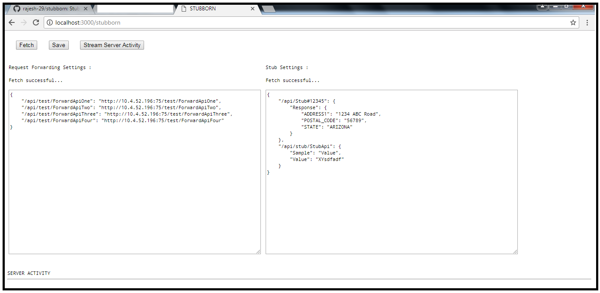

# stubborn
Stubborn is a REST Web services testing tool. Stubborn is an interceptor. It is a node server which returns stub response for given URL (configured on webpage UI).
For other URLs (for which stub is not configured), requests are forwarded to actual server configured in the forwarding settings.

